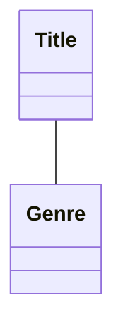
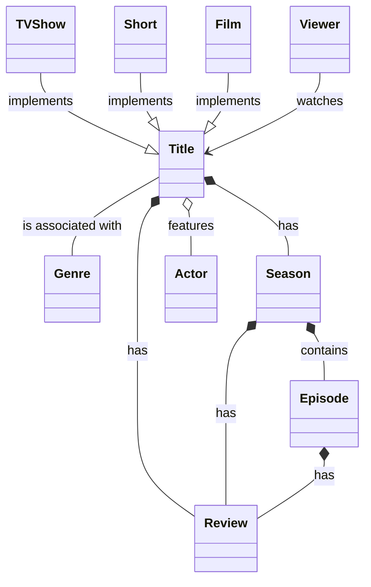
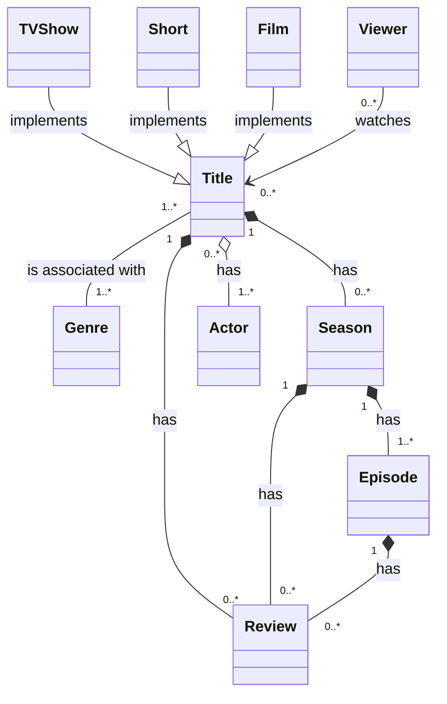

:::todo

Deze tekst moet nog goed onder handen genomen worden. 

- Mermaid-code moet PUML worden
- Referenties naar mermaid.js in de tekst --> plantuml
- Aangezien er een gedeelte van hf 2 is gebruikt, moet er gecontroleerd worden of er geen referenties zijn die raar zijn.

:::

## Bron

:::info

Creating Software with Modern Diagramming Techniques - Ashley Peacock

- Chapter 1 - \[page 1 - 6\] - 7 pages
- Chapter 2 - \[page 14 - 18\] - 5 pages

:::

## Introduction

In the following chapters, we're going to go through the life cycle of creating
an application from scratch. We won't be writing any application code, but
we will be documenting the important steps with diagrams. I've written the
chapters roughly in the order I would go about each step in my professional
career, but you may find a slightly different order works for you.

To start off, we're going to create a domain model. Domain modeling is the
primary way of determining the important aspects of a business. It's usually
created collaboratively by engineering, product, and business stakeholders
to ensure all major parts of the business are aligned on what the domain
model looks like.

That makes it a good candidate for diagramming. By documenting your domain
models with a diagram, that domain model is going to come to life and is more
likely to be practiced. Furthermore, due to the ease of Mermaid, it's possible
to create a draft of the domain model in real time when discussing with colleagues
in a meeting.

The most powerful use of DDD I've experienced was working for an insurance
company. The team I was working in had been tasked with creating a way to
determine how exactly our products were sold and to whom—sounds easy,
right? Unfortunately, the data was all over the place, and customers could
use many avenues to make a purchase, with varying data available in each avenue. 
None of us had any idea how to represent these conceptions in our
code, so we spent several days domain modeling. We tried out different ideas
and approaches, and in the end we landed on a culmination of a few different
ideas and were able to easily translate the domain model into code.

I find the biggest power that comes from domain modeling is the collaboration,
how it brings everyone on the journey and ultimately to the same destination.
It becomes easy to talk about what we are working on, as we're all speaking
the same language, and the code flows easily because we have a clear idea
of how we should represent these business requirements using our domain
model. By the end of the project, even nontechnical stakeholders were using
the same terminology that we had come up with while domain modeling.

The final selling point I'll make for DDD is its ability to allow your domain
and code to evolve over time. Because we're documenting our domain model,
we can reference it at any point. It's very common for new requirements to
come along later, at which point we can refer back to the domain model, see
if it fits the new requirements, and if not, it can evolve and adjust as necessary.
The core of the domain we modeled at the insurance company is still intact
today but has since evolved to add new entities and use cases.

Within UML, one type of diagram available to us is called a class diagram. It
can be used to model classes, but it can also be used to model domains,
which makes a lot of sense when you consider your domain model is implemented
in your codebase with classes. The real power of the diagram is realized
when we start to model relationships between entities, which we can easily
do with a UML class diagram.

## Determine the Important Entities

Firstly, when creating your domain model, think of all the important entities
within your business. For those unfamiliar with the term, an entity represents
a core concept within the business. Entities are typically the phrases that
are most used in the codebase and in meetings. A book publisher, for example,
would likely have entities such as book, chapter, and author. We won’t be
going to this level of detail, but in your codebase they would contain entity
data and business logic. Continuing the publishing example, a book would
have a title for data and perhaps some business logic that calculates the word
count.

The fictional company I’ll be using through these chapters is called Streamy,
which is trying to make a name for itself in the video streaming industry.

I would say for a video streaming company, its most important entity is likely
to be Title—representing the actual videos Streamy offers their customers.

Typically, each `Title` will belong to a Genre, and each Genre will have a list of `Titles`
associated with it. We’ve now identified two entities and how those two entities
are related to one another, so we can start to form our domain model next.

## Document Our First Relationship

Now that we understand what domain-driven design is and what it’s used
for, we can begin to create a domain model for Streamy.
We’re going to use Mermaid to create our domain model, and adding these
two entities is super-simple:



That’s it—our first two entities are defined! If we generate the diagram, it
looks like this:

IMAGE

In Mermaid, the markup for any diagram (with the exception of adjusting
configuration, which we will cover later) is the type of diagram you wish to
create. In our case, that’s a classDiagram, which informs Mermaid how to format
and interpret the following lines.

When creating a domain model in UML, each line after the initial line documents
a relationship between two entities. In the case of `Title` and Genre, where each
entity is going to hold a reference to the other, that type of relationship is known
as an association. In Mermaid, that’s where the second line comes in:

```mermaid
    Title -- Genre
```

To define any relationship, we write down the two entities separated by a set
of symbols that define the type of relationship. An association is defined using
two hyphens. Let’s look at associations in more detail.

## Define Associations

Association is the first type of relationship we’ll cover, and it’s the loosest
type of relationship available within a UML class diagram. Usually, for a
relationship to be classed as an association, the entities must be able to exist
independently of one another and likely have their own life cycles. Furthermore,
there is generally no “owner” of the relationship for associations, they’re
simply linked. In that way, you can think of their relationship as “using” one
another rather than one owning the other.

In our case of `Title` and Genre, we could have a page on our application that
just shows Genres without any `Titles`. However, we probably want to be able to
list the `Titles` within a Genre, and display a specific `Title`’s Genre too, so they need
to have a link of some sort, as all relationships must be documented in a
domain model.

Associations are very loose ways to link two entities, but some relationships
form a closer bond between two entities. Let’s look at one next.

## Describe Relationships

One of the key features of a domain model written with UML is that you can,
and should, describe how the entities interact with regard to their relationships.
In a lot of cases, and in the case of our domain model we have so far,
a lot of the descriptions can be simply described as has. Be as descriptive as
possible, and try to avoid using has for everything where possible.
More detailed descriptions for relationships come into play when the actors
are added to a model (for example, customers or viewers). I’ve added
descriptions to each relationship and updated the Mermaid code:



I added in a Viewer entity that watches Titles to demonstrate a more descriptive
label, which also shows how to add directional association using --> instead
of simply two hyphens (which demonstrated bidirectional association, as we
saw earlier with Genre and Title). This means Viewer holds a reference to Title,
but Title doesn’t hold a reference to Viewer. This makes a lot of sense, as a
Viewer can naturally watch Titles, but the same cannot be said in reverse—unlike
Genre and Title, where they can both reasonably hold references to one another.

For descriptions that are bidirectional, such as Title and Genre, we must describe
it in a way that it works for both. In our example, a Title is associated with a
Genre (and vice versa).

Lastly, for the generalizations, I’ve chosen to describe them using implements.
All this is doing is making clear that Title is a generalization, and it has
specializations such as Film and Short. It has strong links to inheritance in
programming, so implements or extends are both fine. The only reason I
include anything at all is to convey to those not familiar with the diagram’s
arrows that this is an inheritance relationship, where Title has different types.

For all the other relationships, the description is written from the parent’s
point of view (for example, Season contains Episodes).
Mermaid is intuitive, so adding descriptions to relationships is achieved by
simply adding a colon to the end of the line you want to describe and then
writing your description.

Once generated, it looks like this:

Anyone reading the domain model now understands how two entities relate
to each other thanks to the descriptions we just added. But how do you know
the number of entities that can relate to one another? For example, is there
one A related to B, or are there many? We’ll cover this next by taking a look
in detail at what’s called multiplicity.

Our domain model is almost complete, with just a couple of final touches to
go. We’ve added our entities, linked them via relationships, and described
the way in which they are related. However, one thing we’re missing is how
many of one type of entity relates to another. This is called multiplicity, and
it sounds complicated, but you’ll soon see it’s not. You’ve likely encountered
using language like this before, especially if you’ve worked with relational
databases.

You may have noticed that when we write our entities, they’re always written
in the singular form. This is again a nod to the fact that our code, which will
use singular names in class names, should reflect our domain model. Furthermore,
it might be possible, such as the case of Title and Season, that some
Titles might contain a single Season, but others might contain multiple Seasons.

If we always named the entities as plural to account for these cases, it would
be easy for readers of the diagram to misunderstand and assume there are
always multiple, even if that’s not the case.

Luckily, we can define what’s called multiplicity on our domain model. A
fancy term, but in essence it allows you to define whether the relationships
are one-to-one, one-to-many, none-to-many, many-to-many, and everything
in between (for example, more unusual ones such as two-to-three).

Let’s add multiplicity to our Mermaid code:



Once rendered, it looks like the diagram:

To define multiplicity on each relationship, we can optionally put them either
side of the relationship identifier (for example, -- in the first line). I initially
found the way these are defined a little odd, as they feel like they’re on the
wrong side when reading. Collectively they’re known as multiplicity, and
within a relationship’s multiplicity each side is known as a single entity’s
_**cardinality**_.

To explain what I mean, let’s look at Title and Season. Its line looks like so:

```mermaid
Title "1" *-- "0..*" Season: has
```

If we translate this into English, it would read as follows:

- Title has zero to many Seasons.
- Season belongs to one Title.

However, if you were reading it from left to right as the code shows it, you
would probably read it as “Title has 1 Season,” as that’s the first cardinality
you get to. An entity’s cardinality is defined on the opposite side of the
relationship, which can be confusing to begin with.

To help remember how cardinality is defined, particularly when I am looking
at past diagrams, I find it helps to mentally “skip” the first cardinality you
get to. So in the example of Title and Season, when reading Title’s cardinality,
you ignore the 1 and read the rest (Title has 0 to many Seasons). The ordering
is slightly off as the label is at the end, but it’s the best way I’ve found of
quickly understanding at a glance. This works whether you’re reading from
left to right or right to left.

You might be wondering why I chose 0-to-many and not 1-to-many for Seasons—it
was simply because it’s possible to have a title without any seasons yet (for
example, it just has a trailer, with a coming soon notice for the seasons).

